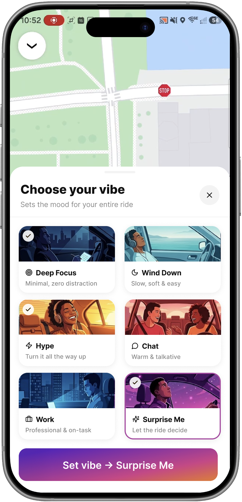

Click here to experience the Prototype - https://vibe-selection-feature.vercel.app/

# Vibe Selection — Uber Concept Feature

A high-fidelity interactive prototype exploring how Uber could let riders personalize their journey before getting in the car - choosing a mood, setting the atmosphere, and syncing their music.



## What it is

This is a product design concept built as a fully interactive React prototype. It covers the complete user flow from ride booking through vibe selection, music pairing, and the active ride experience.

**Vibes available:**
- Deep Focus: minimal, zero distraction
- Wind Down: slow, soft & easy
- Hype: turn it all the way up
- Social: chat-friendly, upbeat
- Work Mode: stay productive on the go
- Surprise Me: let the driver choose

## The Problem

Uber rides are a blank experience. You get in the car and whatever happens, happens; the driver might want to chat when you need silence, play music you hate, or have the AC blasting when you're already cold. Riders have no way to set expectations before they even get in the car, and drivers have no way to know what kind of passenger they're picking up.

**The pain points:**
- No way to signal to your driver how you want the ride to feel
- Music is whatever the driver chose, you have no say
- Awkward silence or unwanted conversation with no polite way out
- Mismatched energy between rider and driver kills the experience
- Every ride feels identical regardless of your mood or purpose

## The Solution

Vibe Selection lets riders set the mood *before* they get in the car. Pick a vibe - Focus, Wind Down, Hype, Chat, Work, or Surprise Me — and the driver sees it before  pickup. No awkward conversations needed. The music, atmosphere, and interaction level 
are all communicated in one tap.

**Why it works:**
- Riders feel in control of their experience without being demanding
- Drivers know exactly what's expected before the passenger gets in
- It turns a transactional ride into a personalized moment
- Works within Uber's existing booking flow, zero extra steps forced on the user

## Flow

1. **Booking screen**: standard Uber map view with vibe entry point
2. **Vibe grid**: browse and select your ride atmosphere
3. **Vibe detail**: expanded view with music options and description
4. **Music selection**: pick a playlist or genre to match your vibe
5. **Confirmation**: vibe is set, driver is notified
6. **Active ride**: immersive in-ride experience with ambient UI

## Tech stack

- **React 18** + **TypeScript**
- **Vite**: fast dev server and build tool
- **Tailwind CSS v4**: utility-first styling
- **Framer Motion**: animations and transitions
- **shadcn/ui** + **Radix UI**: accessible component primitives
- **Lucide React**: icons

## Getting started

```bash
# Install dependencies
npm install

# Start local dev server
npm run dev
```

Open [http://localhost:5173](http://localhost:5173) in your browser.

```bash
# Build for production
npm run build

# Preview production build locally
npm run preview
```

## Design origin

Designed in **Figma Make** and exported as a working React codebase. The design system is based on Uber's visual language — dark backgrounds, gradient vibe tiles, and a mobile-first bottom sheet interaction pattern.

Original Figma file: [Vibe Selection Feature](https://www.figma.com/make/VPY539KnCvbWABtKC7LDIY/Vibe-Selection-Feature)

## Project structure

```
src/
├── app/
│   ├── App.tsx              # Main app — all screens and state
│   └── components/
│       └── ui/              # shadcn/ui component library
├── imports/
│   └── Frame71–80/          # Per-screen assets from Figma
├── styles/
│   ├── globals.css
│   ├── theme.css
│   └── tailwind.css
└── main.tsx
```

---

Built with [Figma Make](https://www.figma.com/make) + [Claude](https://claude.ai)
